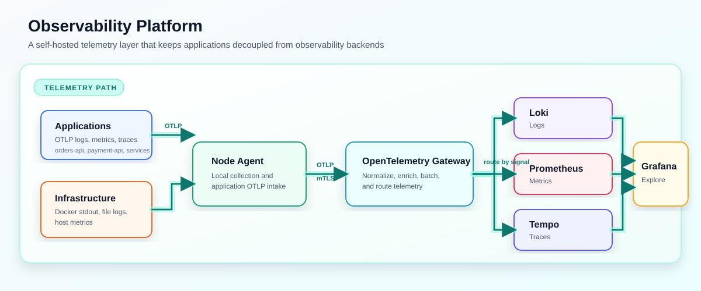
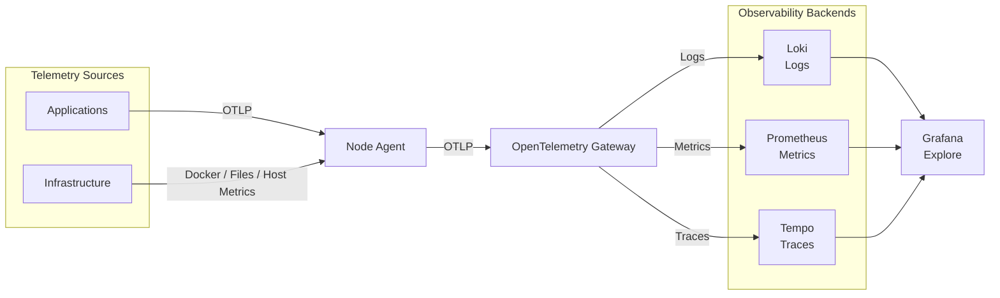
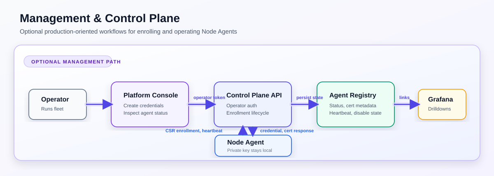
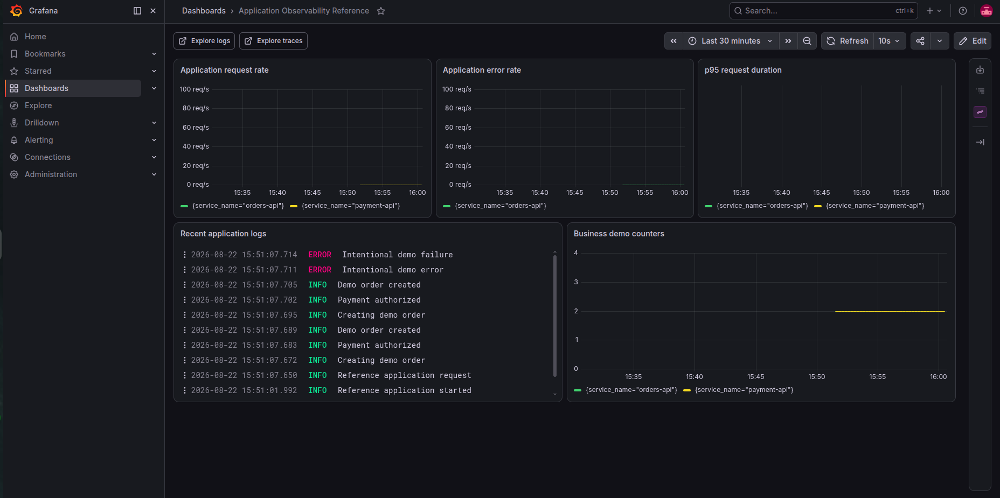
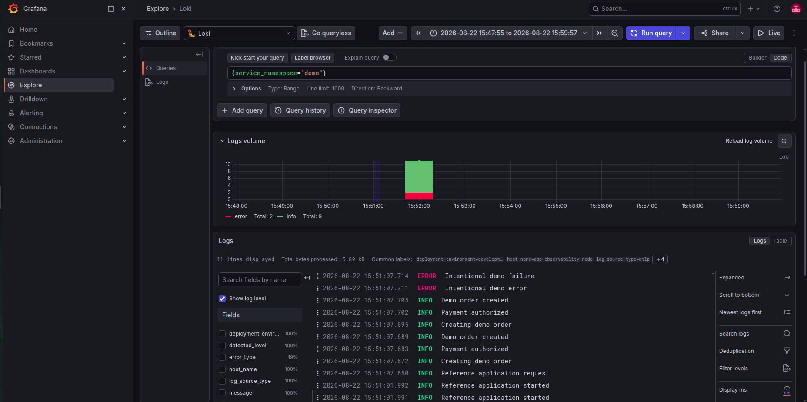
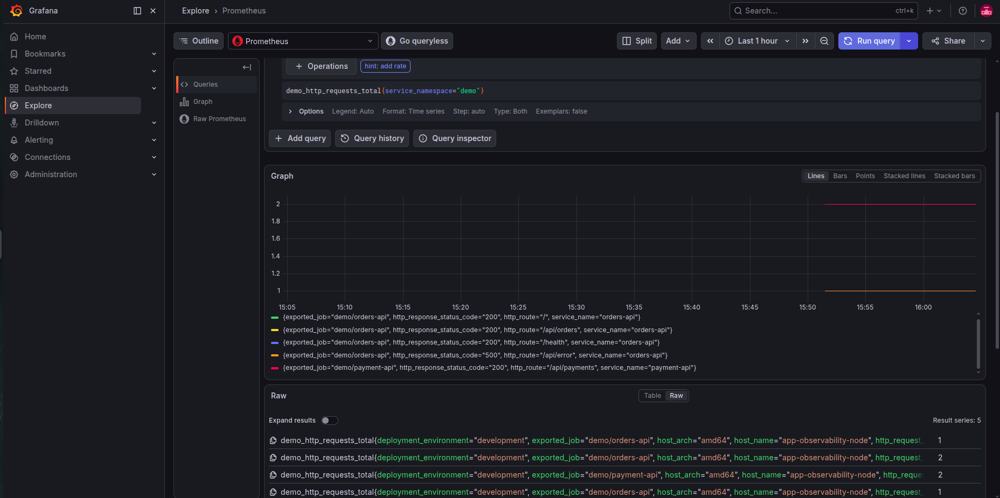
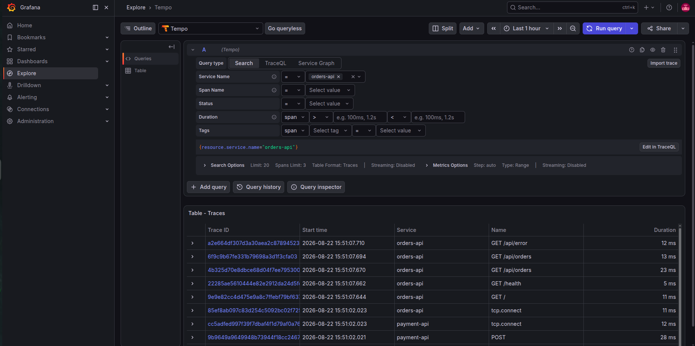

# Observability Platform

A self-hosted telemetry layer for applications and infrastructure.

Collect logs, metrics, and traces through OpenTelemetry, centralize processing through a Gateway, and explore the resulting telemetry through Grafana.

[](https://opentelemetry.io/)
[](https://docs.docker.com/compose/)
[](LICENSE)

**Collect → Process → Store → Explore**

`Logs` · `Metrics` · `Traces` · `Agents` · `Gateway` · `Grafana`



> A reusable telemetry layer that keeps applications decoupled from observability backends.

[Architecture](#architecture) · [Quick Start](#quick-start) · [Capabilities](#capabilities) · [Documentation](#documentation)

## What Is It?

Observability Platform is a self-hosted, single-tenant Docker Compose profile for centralizing logs, metrics, and traces from applications and infrastructure. It separates local collection from centralized processing, storage, and exploration:

- Applications emit OpenTelemetry Protocol (OTLP) telemetry to a local Node Agent.
- Node Agents collect Docker stdout, explicitly mounted file logs, host metrics, and application OTLP telemetry.
- The Gateway normalizes, enriches, batches, and routes signals to their backends.
- Grafana provides dashboards, Explore, and correlation workflows across the collected data.

The v0.1.0 profile is designed for a single host or VM.

Telemetry stays in the operator's infrastructure unless external storage or forwarding is configured outside this repository.

## Why

Applications should not need to know about log, metric, trace, or dashboard backends. Infrastructure collection should not require every workload to own its telemetry transport. Observability Platform creates a stable boundary:

- **Node Agents** own node-local collection and application intake.
- **The Gateway** owns centralized OpenTelemetry processing and backend routing.
- **Backends and Grafana** own storage, querying, visualization, and investigation.

This lets applications emit standard OTLP while operators choose consistent collection profiles, security controls, and observability workflows.

## Architecture



## Management & Control Plane

This path is optional for local telemetry collection. It answers: “How are Node Agents enrolled and operated across hosts?”



For a concrete walkthrough, see the [Agent Management Lifecycle](docs/agent-management-lifecycle.md) guide.

The architecture keeps collection, transport, processing, storage, and exploration separate:

- **Node Agent:** local collector and OTLP endpoint for applications; it does not contain backend-specific configuration.
- **OpenTelemetry Gateway:** centralized receiver, processor, and signal router.
- **Loki, Tempo, and Prometheus:** self-hosted log, trace, and metric backends. Prometheus scrapes metrics exposed by the Gateway.
- **Grafana:** the primary UI for telemetry queries, dashboards, and exploration.
- **Control Plane and Console:** optional production-oriented management for enrollment, Agent Registry lifecycle, fleet status, and links to relevant Grafana views.

## Capabilities

| Area | Available in v0.1 |
| --- | --- |
| Collection | Application OTLP logs, metrics, and traces; Docker stdout; explicitly mounted file logs; and host CPU, memory, filesystem, and network metrics |
| Agent profiles | Capability profiles for OTLP, Docker, file logs, and host metrics |
| Processing | Gateway normalization, enrichment, batching, routing, and Prometheus metric exposure |
| Storage and exploration | Loki logs, Tempo traces, Prometheus metrics, Grafana datasources, dashboards, Explore, and log/trace correlation |
| Agent lifecycle | One-time enrollment credentials, node-local private-key generation, CSR-only enrollment, Agent Registry, heartbeats, certificate metadata, renewal, and disable controls |
| Transport security | mTLS support with a production-oriented external issuer boundary; plaintext OTLP remains available for migration and rollback |
| Operations | Single-tenant operator-token API access, persistent queues for Gateway log and trace export, local retention controls, health checks, self-monitoring, backup/restore, and acceptance tooling |

The repository includes an instrumented `orders-api` / `payment-api` reference application for validating distributed traces, logs, metrics, and error investigation.

## Quick Start

### Local or evaluation path

Use the reference application workflow for isolated evaluation. It generates throwaway development mTLS material and must not be used for production.

```bash
git clone https://github.com/yashikagarg05/observability-platform.git
cd observability-platform

make demo-up
make demo-traffic
```

Open Grafana at `http://localhost:3000` and sign in with the local `.env` credentials (`admin` / `admin` by default). See the [application observability guide](docs/application-observability.md) for verification and troubleshooting.

If port `3000` is already in use, change `GRAFANA_PORT` in `.env` before starting the stack. Stop the demo with `make demo-down`.

### Production-oriented path

The supported single-tenant path requires a Linux host with Docker and Docker Compose, a long random operator token, and production PKI material prepared outside this repository. Production enrollment uses an external/customer-managed issuer command.

```bash
cp deployments/production/production.env.example /etc/observability-platform/production.env
# Edit /etc/observability-platform/production.env and replace every changeme value.

set -a
. /etc/observability-platform/production.env
set +a

docker compose \
  -f docker-compose.yml \
  -f deployments/docker-compose/production.yaml \
  up -d

docker compose \
  -f docker-compose.yml \
  -f deployments/docker-compose/production.yaml \
  ps
```

Configure at least the tenant ID, operator token, Grafana password, certificate paths, enrollment PKI path, issuer mode, external issuer command, and trace retention before startup. Follow the [production quickstart](docs/production-quickstart.md) for the complete procedure and the [production deployment guide](docs/production-deployment.md) for configuration, retention, recovery, and validation.

## See It in Action

The included reference application and provisioned Grafana dashboards provide the live demonstration:

- **Application Observability Reference** shows request rate, error rate, latency, recent logs, and demo counters for `orders-api` and `payment-api`.
- **Platform Self-Monitoring** shows platform scrape health, Gateway telemetry, export failures, queues, CPU, and memory.



The demo includes cross-signal verification for application logs, metrics, and traces:

| Signal | Example |
| --- | --- |
| Logs |  |
| Metrics |  |
| Traces |  |

Run the evaluation workflow above, open Grafana, and use the [application observability guide](docs/application-observability.md) to verify logs, metrics, traces, and correlation. The [visual asset checklist](docs/images/README.md) tracks remaining screenshots to capture for the next public release.

## How It Works

1. Applications emit OTLP to a local Node Agent. The Agent can also collect Docker stdout, selected file logs, and host metrics from its node.
2. The Node Agent forwards OTLP to the Gateway. The production-oriented deployment supports mTLS; plaintext OTLP is retained for migration and rollback.
3. The Gateway processes telemetry, exports logs to Loki and traces to Tempo, and exposes metrics for Prometheus to scrape.
4. Grafana queries Loki, Tempo, and Prometheus for dashboards, Explore, and cross-signal investigation.
5. Operators use the Control Plane API and Platform Management Console to enroll Agents, inspect fleet state, and reach relevant Grafana views.

## Components

| Component | Purpose |
| --- | --- |
| [Node Agent](collector/agent) | Collects node-local sources and accepts application OTLP; forwards OTLP to the Gateway |
| [OpenTelemetry Gateway](collector/gateway) | Receives, normalizes, enriches, batches, and routes telemetry |
| [Loki](loki), [Prometheus](prometheus), and [Tempo](tempo) | Store and query logs, metrics, and traces |
| [Grafana provisioning and dashboards](grafana) | Provides pre-provisioned datasources, dashboards, and correlation |
| [Control Plane API](services/enrollment) | Provides enrollment, Agent Registry, lifecycle, and fleet APIs |
| [Platform Management Console](frontend) | Provides browser workflows for fleet visibility and enrollment |
| [Reference application](examples/app-observability) | Demonstrates distributed traces, logs, metrics, and error investigation |

## Platform Management Console

The Platform Management Console provides fleet and control-plane workflows: overview, Agents, enrollment credentials, sites, environments, capabilities, integrations, certificate status, and links to relevant Grafana views.

Enter the configured operator token in the Console to access production Control Plane APIs. The Console is not a replacement for Grafana: Grafana remains the primary interface for logs, metrics, traces, dashboards, and Explore.

## Deployment

Two deployment modes are available:

- **Local/evaluation:** the reference application and throwaway development mTLS material validate the telemetry path.
- **Production-oriented:** a single-tenant, single-node Docker Compose deployment with Gateway mTLS transport, external issuer integration, persistent Gateway queues for logs and traces, local retention controls, health checks, backup/restore scripts, and an acceptance checklist.

The production-oriented profile is not highly available, multi-tenant, or a Kubernetes deployment. Review [production deployment](docs/production-deployment.md), [production enrollment and certificate lifecycle](docs/production-enrollment-lifecycle.md), and the [production acceptance checklist](docs/production-acceptance-checklist.md) before operating it.

## Documentation

### Getting started

- [Production quickstart](docs/production-quickstart.md)
- [Node Agent onboarding](docs/node-agent-onboarding.md)
- [Agent Management Lifecycle](docs/agent-management-lifecycle.md)
- [Application observability reference](docs/application-observability.md)

### Security and enrollment

- [Node Agent mTLS](docs/node-agent-mtls.md)
- [Node Agent enrollment MVP](docs/node-agent-enrollment-mvp.md)
- [Production enrollment and certificate lifecycle](docs/production-enrollment-lifecycle.md)
- [Production PKI](docs/production-pki.md)

### Operations

- [Production deployment](docs/production-deployment.md)
- [Production acceptance checklist](docs/production-acceptance-checklist.md)
- [Compatibility](docs/releases/compatibility.md)
- [Container image policy](docs/releases/image-policy.md)
- [Release process](docs/releases/release-process.md)

### Community and releases

- [Contributing](CONTRIBUTING.md)
- [Code of conduct](CODE_OF_CONDUCT.md)
- [Changelog](CHANGELOG.md)
- [Security policy](SECURITY.md)

### Architecture and telemetry

- [Platform architecture](docs/platform-architecture.md)
- [Trace and log correlation](docs/trace-log-correlation.md)
- [Docker logging](docs/docker-logging.md)
- [Node Agent migration](docs/remote-log-collection.md)

## Scope and Roadmap

### Current scope

v0.1.0 is intentionally scoped to a single tenant on a single host or VM with local persistent storage. It does not provide high availability, backend replication, Kubernetes deployment, multi-tenant isolation, remote Agent upgrades/configuration, a bundled production CA, or Gateway-side dynamic certificate revocation.

### Roadmap

Future work may address Kubernetes deployment, highly available storage options, deeper production CA integrations, stronger Gateway-side authorization, and broader packaging. Current operational boundaries are documented in the [production deployment guide](docs/production-deployment.md).

## Security

Report vulnerabilities according to the [security policy](SECURITY.md). For deployment security, review the [production PKI guide](docs/production-pki.md) and [production enrollment and certificate lifecycle](docs/production-enrollment-lifecycle.md). Keep production private keys, certificates, environment files, tokens, and backups outside the repository.

## License

Licensed under the [Apache License 2.0](LICENSE).
